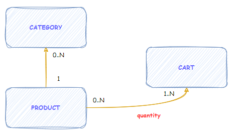

# transaction-manager

## Description

Purpose of this project is to create the backend application which manage transaction.

### Product

A product has a **uniq** `name`, a `description`, a `price` and is part of a Category.

**Examples:**

 - Apple
 - Raspberry
 - Cherry
 - Pear
 - Carrot 
 - Zucchini
 - Peas
 - Water
 - Cola

### Category

A category has a **uniq** `name` and a `description`. It is used to regroup products of the same kind.

**Examples:**

 - Fruit
 - Vegetable
 - Beverage

### Transaction

A transaction is a set of product with, for each, the `quantity`. Based on this, the transaction has a computed `amount`.
A transaction has as well a `status` ("PENDING", "APPROVED", "REJECTED") and a `creation date` automatically settled by the application.

---

## API 

 - Provide CRUD features for Category, Product and Transaction.

## Advanced features

 - Validation rule:
   - Product:
     - `name` is mandatory
     - `description` length should be between 3 and 255 chars
     - `price` is positive
   - Category
     - `name` is mandatory and each word should be in lower case but start with upper case letter.
 - Concurrent access management
 - Advanced search feature:  We could search products with dynamic criteria (only on the name, name and description, name and price...)
 - Provide documentation for the API
 - Secure the application